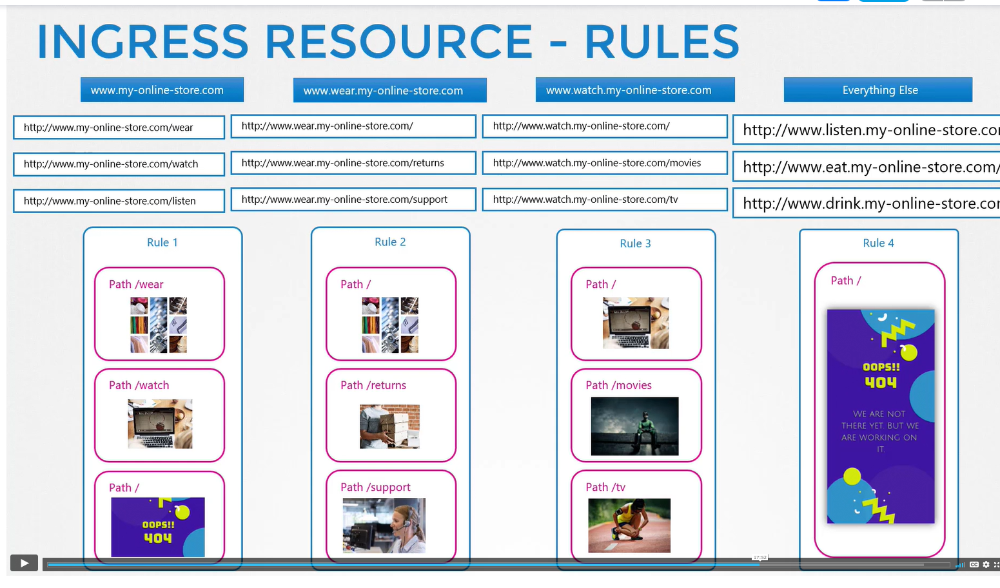

# Service and Networking

## Services
- enables the connections outside and inside the cluster
- Type of service
  - NodePort
    - exposing a port of node that is mapped to the pod
  - ClusterIp
    - services creates virtualIp inside the cluster 
  - LoadBalancer
    - provisions a load balancer
    
### NodePort Service
- targetPort
  - a port exposed of the pod
- port
  - service port
- nodePort
  - port of the node to be exposed
  - only have a valid range 3000-32767
- def-file
```yaml
apiVersion: v1
kind: Service
metadata:
  name: <service-name>
spec:
  type: NodePort
  ports: 
    - targetPort: 80
      port: 80
      nodePort: 30008
  selector:
    <pod-label>: <pod-label-value>
```
- what if the pods are distributed in multiple nodes
  - kube automatically maps the port of all nodes to the pods on the node
### ClusterIP Service
- create an interface to group pods together
- def-file
```yaml
apiVersion: v1
kind: Service
metadata:
  name: <service-name>
spec:
  type: ClusterIp
  ports: 
    - targetPort: 80 # pod-port
      port: 80 #service-port
  selector:
    <pod-label>: <pod-label-value>
``` 

## Network Policies
- 2 types of traffic
  - Ingress
    - Incoming traffic
  - Egress
    - Outgoing traffic
- Network Security In kubernetes
  - By default, the Ingress and Egress is allowed on every resources
- How to apply network policy to a pod
```yaml
apiVersion: networking.k8s.io/v1
kind: NetworkingPolicy
metadata:
  name: <policy-name>
spec:
  podSelector: #the po which will the network policy be applied to
    matchLabels:
      role: db 
  policyTypes:
    - Ingress
    - Egress 
  ingress:
    - from:
      - podSelector: # the pod which will the topic will come from pod labeled api-prod 
          matchLabels:
            name: api-pod
        namespaceSelector: # and the pod which will the topic will came from
          matchLabels:
            name: staging
      - namespaceSelector: # the pod which will the topic will come from namespace labeled prod
          matchLabels:
            name: dev
      - ipBlock:
          cidr: 192.168.5.10/32
      ports:
        - protocol: TCP
          port: 3306
  - egress:
      - to:
        - ipBlock:
            cidr: 192.168.5.10/32
        ports:
          - protocol: TCP
            port: 3306
        
            
-    
```

## Ingress Networking
- Service
  -  
- Ingress Controller
  - by default there's no ingress controller
  - nginx-controller
    - how to create an nginx-controller
      - deploy as a deployment with different image 
      - create a config map
      - map the config map to the nginx deploy via `spec.args[]`
      - set env of the `POD_NAME` and `POD_NAMESPACE`
      - expose the containerPort
      - create a service type of `NodePort`
      - create a service account with Roles, ClusterRoles, and RoleBindings
  - ingress-resources
    - sets of rules and config applied to ingress-controller
    
- Ingress Definition file with no Rules
```
apiVersion: networking.k8s.io/v1
kind: Ingress
metadata:
  name: ingress-wear
spec: 
  backend: #
    serviceName: wear-service
    servicePort: 80

```
- Ingress Definition file with rules based on the path
```
apiVersion: networking.k8s.io/v1
kind: Ingress
metadata:
  name: ingress-wear
spec: 
  backend: #
    serviceName: wear-service
    servicePort: 80
  rules:
  - http:
      paths:
      - path: /wear
        pathType: Prefix
        backend:
          service:
            name: wear-service
            port: 80
      - path: /watch
        pathType: Prefix
        backend:
            service:
              name: watch-service
              port: 80
            
```
- Ingress Definition file with rules based on host
```
apiVersion: extensions/v1beta1
kind: Ingress
metadata:
  name: ingress-wear
spec: 
  backend: #
    serviceName: wear-service
    servicePort: 80
  rules:
  - host: wear.my-online-store.com
    http:
      paths:
      - backend:
          serviceName: wear-service
          servicePort: 80
  - host: watch.my-online-store.com
    http:
      paths:
      - backend:
          service
            name: watch-service
            port: 80
```
- Ingress Rules

  

