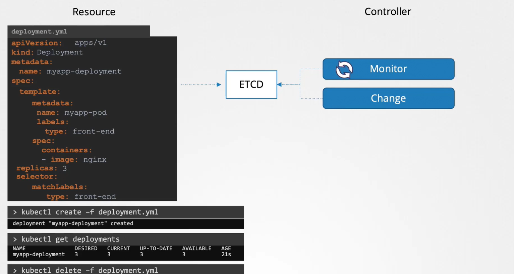

# Sept 2021 Update

## Docker images

## Auth, Authorization, and Admision Control
- Auth
  - answers the "who can access the kube-server?"
  - Auth can be 
    - username and pass
    - username and tokens
    - certs
    - external auth provider
    - service accounts for machines/services
- Authorization
  - answers the "what they can do to the server?"
- Network Policies
  - security connection within the cluster

### Authentication
#### Accounts
- User
  - Manage by kube-apiserver 
  - Auth mechanism
    - static password file
      - create a csv file with 3 columns()
    - static token file
    - certs 
    - identity services like ldap
- Bots/Service/Apps
  - Auth mechanism 
    - service accounts
### KubeConfig
- a default file that contains config which automatically added to the `kubectl` cmd
- located in `$HOME/.kube/config`
- Has 3 sections
  - Clusters
    - eg: prod or dev clusters 
  - Contexts
    - some kind of session 
    - connects the user and clusters
    - e.g: devUser@devCluster
  - Users
    - e.g: user accounts
- to change context
  - `kubect config use-context `

### API Groups
- check api version
  - `curl https://kube-master:6643/version`
- api groups
  - /version
  - /metrics
  - /api
  - /apis
  - /logs
- /api
  - core group
    - v1
- /apis
  - named groups
### Authorization
- Why authorization is needed?
  - to control the user's access to the resources
- To check the authorization being used
  - `kubectl describe pod kube-apiserver-controlplane -n kube-system`
- Authorization Mechanism
  - Node
    - kubelet in the node access the kube-api.
      Node Authorizer handles this authorizing this access
  - ABAC
    - Attribute Based Access Control
    - Creating a policy file and pass it to the api-server
  - RBAC
    - Role Based Access Control
    - 1: Creates a role with privileges 
    - 2: Associate user's account to the role, user will have the privileges of that role.
  - Webhook
    - Outsourcing the authorization mechanism
  - Authorization Mode
    - Aside from the auth mechanism above there is also AlwaysAllow and AlwaysDeny, which is self-explanatory mode 
    - by default: AlwaysAllow
    - can be set in api-server e.g: `--authorization-mode:Node,RBAC,Webhook`
    - If multiple auth-mode is set it will do the ff
      - e.g auth-modes: Node,RBAC,Webhook
        - It wil check on auth mode one-by-one until it was authed
### RBAC
#### Creating a role
- Created in namespace
- Namespace scoped
```yaml
apiVersion: rbac.authorization.k8s.io/v1
kind: Role
metadata:
  name: role-name
rules:
  - apiGroups: [""] # "" for core group to others it needs to be specified
    resources: ["pods"] #
    verbs: ["list","get","create","update","delete"] # things you can do
    resourceNames: # Optional. Only needed if you want to specify a certain resources on which the role will be applied to.
      - "pod-name-1"
      - "pod-name-2"
```
- Creating RoleBinding
  - bind the role to a user
```yaml
apiVersion: rbac.authorization.k8s.io/v1
kind: RoleBinding
metadata: 
 name: rolebinding-name
subjects: # users
  - kind: User
    name: dev-user
    apiGroup: rbac/authorization.k8s.io #api group of the user(?)
roleRef:  # role
  kind: Role
  name: role-name # should be matched with the metadata.name of the roles
  apiGroup: rbac/authorization.k8s.io #api group of the user(?)
  
```
- **To check access**
  - `kubectl auth can-i <verb> <resources`
    - e.g: `kubectl auth can-i create deployments`
    - if the access of other user, just add `--as` option followed by username
      - e.g: `kubectl auth can-i create pods --as dev-user`
    - access on a certain namespace is also can be checked
      - e.g: `kubetl aut can-u create pods --as dev-user --namespace namespace-name`
#### ClusterRole
- Cluster wide
- ClusterRole scoped
  - example resources: pv, nodes, ns, etc..
- same as creating with role and rolebinding except it used clusterrole and clusterrolebinding keyword in definition file

### Admission Controllers
- help to implement better security measure on how cluster is used and change the request itself. In spring world this a somekind of filter
- e.g of authorization
  - user -> kubectl -> authentication -> authorization -> admission controllers -> operation(e.g create pod)
- `kube-apiserver -h | grep enable-admission-plugins` or `kubectl exec -it kube-apiserver-controlplane -n kube-system -- kube-apiserver -h | grep 'enable-admission-plugins'`
  - to view the enable admission controllers

- to add admission controllers
  - update the `--enable-admission-plugins` in `/etc/kubernetes/manifests/kube-apiserver.yaml`
- to disable an admission controllers
  - update the `--disable-admission-plugins` in `/etc/kubernetes/manifests/kube-apiserver.yaml`
#### Types of admission controller
- Mutating admission controller
  - can mutate the object
- Validating admission controllers
  - validates the object
- External Admission Controllers
  - How does it work?
    - this works by pointing to a server external/internal
    - it will send a request object
    - server should response an object with `allowed` attribute that should have a value of true|false
  - Setup
    - deploy a webhook server
    - if internal create a service
    - create a WebhookConfiguration either ValidatingWebhookConfiguration or MigratingWebhookConfiguration
  - type of external admission controller
    - MutatingAdmission Webhook
    - ValidatingAdmission Webhook
     
## Api Version
- Versioning
  - alpha
    - vXalphaY
    - first time it was added on the release
    - not enable by default
    - may have bugs and not yet stable
  - beta
    - vXbetaY
    - enable by default
    - has e2e tests
    - may have minor bugs
    - commitment to be added in GA/Stable version
  - v1
    - e.g: v1
    - enable by default
    - highly reliable
    - available to all user
- api group can support multiple version
- `kubectl explain <object>`
- `kubect api-resources`
  - show the available resource
- To check the api versions
  - `kubect proxy`
    - creates a localhost proxy server to the kube-apiserver
  - `curl <local-proxy>/api/<api-group>`
    - will call an api. Response should have a preferred attribute.
  - 
## Api Deprecation
- Lifecycle of Api group
- Api Deprecation Policy Rule
  - Api element can be only be removed by incrementing the version of the API Group 
  - Api object must be able to round-trip between API vrsions in a given release without information loss,
  with the exception of whole REST resources that do not exist in some versions.
- `kubectl convert -f <old-file> --output-version <new-api>`
  - use on converting the older version of manifest file to new version
  - e.g: `kubect convert -f old-manifest.yaml --output-version apps/v1`

## CustomResources

- Resource
  - `kubectl create <resouce>` creates a resource in etc
- Controller
  - monitors `resources` in etcd and if it detected a change it will do the necessary changes needed
  - written in go
- CustomResourceDefintion(CRD)
  - a definition file for creating a custom resource
```yaml
apiVersion: apiextensions/k8s.io/v1
kind: CustomResourceDefinition
metadata:
  name: flighttickets.flights.com
spec:
  scope: Namespaced #whether namespaced/non-namespaced(cluster lvl)
  group: flights.com #api group the first part of apiVersion in a def file e.g: `apps` in apiVersion:apps/V1
  names:
    kind: FlightTicket #kind in definition file
    singular: flightticket #describe the resource during kubectl cmd
    plural: flighttickets #describe during kubectl api-resource
    shortNames: #short name e.g cm in  `kubectl get cm`
      - ft 
    versions: # arrays of version
      - name: v1
        served: true #served to api server
        storage: true #
        schema: #parameters in spec 
          openAPIV3Schema: #
            type: object
            properties:
                spec:
                    type: object
                    properties:
                      from: # will be spec.from in definition file
                          type: string # datatype
                      to: # will be spec.to in definition file
                          type: string
                      number: # will be spec.numbe in definition file
                          type: integer # dataype
                          minimum: 1 # validtion of the value
                          maximum: 10 # validation of the value
        
```

## Custom Controllers
- no question in exam
- written in go
## Operator Framework
- packaged CRD and Custom Controller

---
## Deployment Strategy
- Recreate
  - delete all pods and up all po
- RollingUpdate
  - one by one deleting and uping of pods
- Blue/Green
  - 2 deployment of blue(origin version) and green(new version)
    - changing traffic between 2 deployments
  - Step By Step
    - Create a service that used a label a selector to blue(deployment)
    - Deploy the green deployment(new version)
    - Test the green deployment
    - If all passed changed the label of service to match the green deployment
    so that the traffic can be redirected to green deployment
- Canary Update
  - Routing of small traffic to new version
  - Step By Step
    - Deploy origin version(primary)
    - Create service to route to primary
    - Deploy second deployment(canary)
    - Create a common label to match both deployment
    - Reduce the pods in canary deployment based on the percentage
    - Then rescale canary to become 100% then delete primary deployment
## Helm
- package manager of kubernetes resources
- Helm concepts
  - templates
    - a kubernetes definitions but without the actual value of fields(e.g: image)
    - `{{ .Values.image }}` 
      - a sample value place holder. The value can be set in values.yaml `image: <value>` 
  - values.yaml
    - a file where the values that an be set to templates
  - Chart
    - consist the ff
      - values.yaml
      - templates
      - Chart.yaml
        - 
      - 